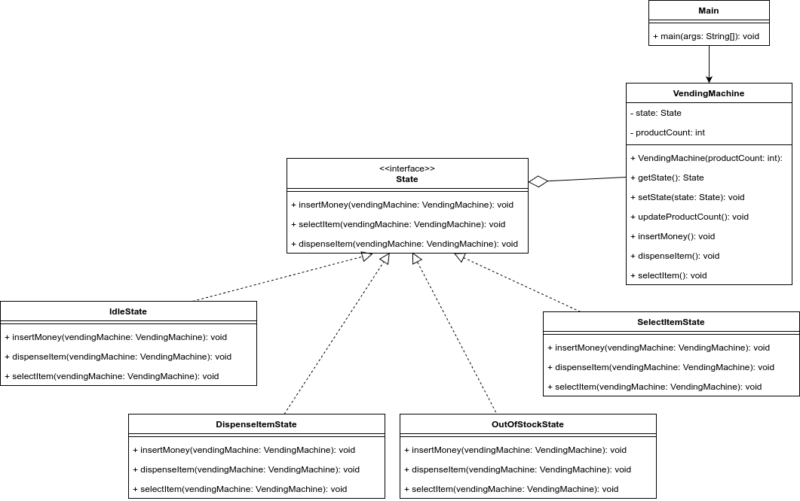

# Lab Assignment 7: Write a Java program to demonstrate the implementation of a state design pattern for a vending machine functionality on purchasing items.

## Class Diagram

## Structure of the Program

1. `State` interface: names all the common methods for the various states of a vending machine.
1. `IdleState` class: implements the `State` interface with functionalities of a vending machine when it is Idle.
1. `OutOfStockState` class: implements the `State` interface with functionalities of a vending machine when it does not have any product in its inventory.
1. `DispenseItemState` class: implements the `State` interface with functionalities of a vending machine for dispensing an item from the inventory.
1. `SelectItemState` class: implements the `State` interface with functionalities for selecting an item from the inventory of a vending machine.
1. `VendingMachine` class: this class contains the definition of a vending machine.
1. `Main` class: contains the `main` method and demonstrates the state pattern.

## Ouput
The output of the demo program can be found inside <a href="Out.txt">Out.txt</a>